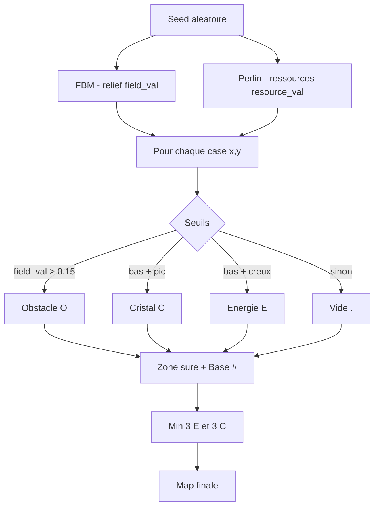

# Explication de `src/map.rs`

Ce module génère la carte du jeu de façon **procédurale** à l'aide du **bruit de Perlin**. Chaque lancement produit une grille différente (obstacles, ressources, base).

---

## Vue d'ensemble

```
Map::new(width, height)
    │
    ├─ 1. Initialiser le bruit (FBM + Perlin)
    ├─ 2. Remplir chaque case selon des seuils
    ├─ 3. Dégager la zone autour de la base
    ├─ 4. Garantir au moins 3 E et 3 C
    └─ 5. Retourner la Map
```

---

## Dépendances

```rust
use noise::{Fbm, MultiFractal, NoiseFn, Perlin};
use rand::Rng;
```

| Crate | Rôle |
|-------|------|
| `noise` | Bruit de Perlin et FBM pour le terrain |
| `rand` | Seed aléatoire, quantités des ressources (50–200) |

---

## Les types

### `MapTile` — contenu d'une case

```rust
pub enum MapTile {
    Empty,
    Obstacle,
    Energy(u32),
    Crystal(u32),
    Base,
}
```

| Variante | Symbole UI | Signification |
|----------|------------|---------------|
| `Empty` | `.` | Case libre et traversable |
| `Obstacle` | `O` | Mur / rocher, **non traversable** |
| `Energy(n)` | `E` | Source d'énergie avec **n** unités (50–200) |
| `Crystal(n)` | `C` | Gisement de cristaux avec **n** unités |
| `Base` | `#` | Base centrale |

**Important :** un gisement = **une seule case**. Le `u32` est le stock restant sur cette case, pas le nombre de cases.

### `Map` — la grille

```rust
pub struct Map {
    pub tiles: Vec<Vec<MapTile>>,
    pub width: usize,
    pub height: usize,
}
```

- `tiles[y][x]` : accès ligne puis colonne (convention grille 2D)
- Dimensions typiques : 20×20 (défini dans `main.rs`)

---

## `Map::new()` — génération en 4 étapes

### Étape 1 — Initialisation du bruit

```rust
let seed: u32 = rand::random();
let mut rng = rand::thread_rng();
```

- `seed` : graine unique à chaque partie → carte différente à chaque `cargo run`
- `rng` : générateur pour les quantités 50–200

#### Couche relief (FBM)

```rust
let field = Fbm::<Perlin>::new(seed)
    .set_octaves(5)
    .set_frequency(1.0)
    .set_persistence(0.5)
    .set_lacunarity(2.0);
```

Le **FBM** (*Fractal Brownian Motion*) superpose plusieurs octaves de Perlin pour un relief naturel.

| Paramètre | Valeur | Effet |
|-----------|--------|-------|
| `octaves` | 5 | Nombre de couches de détail |
| `frequency` | 1.0 | Fréquence de base |
| `persistence` | 0.5 | Poids des petits détails |
| `lacunarity` | 2.0 | Écart de fréquence entre octaves |

Sortie approximative : `field_val` ∈ [-1.0, 1.0]

#### Couche ressources (Perlin simple)

```rust
let resource_layer = Perlin::new(seed.wrapping_add(1));
```

Deuxième bruit, seed différente, pour placer les ressources en **poches** plutôt qu'au hasard.

#### Échelle

```rust
let scale = 1.5 / width.max(height) as f64;
```

Adapte les coordonnées à la taille de la carte pour que le bruit traverse environ 1,5 période sur la grille (évite un relief trop serré ou trop plat).

---

### Étape 2 — Remplissage case par case

```rust
for y in 0..height {
    for x in 0..width {
        let nx = x as f64 * scale;
        let ny = y as f64 * scale;

        let field_val = field.get([nx, ny]);
        let resource_val = resource_layer.get([nx * 4.0, ny * 4.0]);
        // ...
    }
}
```

Pour chaque `(x, y)` :
1. Conversion en coordonnées continues `(nx, ny)`
2. `field_val` : hauteur du terrain (FBM)
3. `resource_val` : bruit secondaire (×4.0 = variations plus rapides → **taches plus petites**)

#### Règles de placement (seuils)

```rust
if field_val > 0.15 {
    MapTile::Obstacle
} else if field_val < -0.2 && resource_val > 0.6 {
    MapTile::Crystal(rng.gen_range(50..=200))
} else if field_val < -0.2 && resource_val < -0.6 {
    MapTile::Energy(rng.gen_range(50..=200))
} else {
    MapTile::Empty
}
```

| Condition | Résultat |
|-----------|----------|
| `field_val > 0.15` | Zone haute → **Obstacle** |
| `field_val < -0.2` ET `resource_val > 0.6` | Zone basse + pic → **Cristal** |
| `field_val < -0.2` ET `resource_val < -0.6` | Zone basse + creux → **Énergie** |
| Sinon | **Vide** |

Les seuils (`0.15`, `-0.2`, `±0.6`) ne viennent pas de Perlin : ce sont des constantes **réglées à la main** pour équilibrer la carte.

```
 1.0  ─────────────────────────
 0.15 ────────────▲ seuil obstacle
 0.0  ────────────┼─────────────
-0.2  ────────────▼── zones ressources
-1.0  ─────────────────────────
```

---

### Étape 3 — Zone sûre autour de la base

```rust
let base_x = width / 2;
let base_y = height / 2;
for dy in -2i32..=2 {
    for dx in -2i32..=2 {
        // ...
        tiles[cy][cx] = MapTile::Empty;
    }
}
tiles[base_y][base_x] = MapTile::Base;
```

- Base au **centre** de la carte
- Carré **5×5** (rayon 2) forcé en `Empty` → les robots ne spawnent pas dans un obstacle
- Case centrale = `MapTile::Base`

---

### Étape 4 — Minimum de ressources

Le bruit peut parfois placer peu de ressources. Ce filet de sécurité garantit **au moins 3** sources d'énergie et **3** gisements de cristaux.

```rust
let energy_count = tiles.iter().flatten()
    .filter(|t| matches!(t, MapTile::Energy(_)))
    .count();

for _ in 0..3_usize.saturating_sub(energy_count) {
    Self::place_resource_randomly(&mut tiles, width, height, &mut rng, false);
}
```

| Déjà placé | Calcul `3 - count` | Ajouts |
|------------|-------------------|--------|
| 0 | 3 | 3 ressources |
| 1 | 2 | 2 ressources |
| 2 | 1 | 1 ressource |
| 3+ | 0 | rien |

Même logique pour les cristaux avec `is_crystal: true`.

---

## `place_resource_randomly()` — placement de secours

```rust
fn place_resource_randomly(tiles, width, height, rng, is_crystal: bool)
```

1. Tire une position `(x, y)` au hasard
2. Si la case est `Empty` → y place `Energy` ou `Crystal` (50–200 unités)
3. Sinon réessaie (max 200 tentatives)

Utilisé uniquement par l'étape 4 quand le bruit n'a pas assez placé de ressources.

---

## `is_walkable()` — navigation

```rust
pub fn is_walkable(&self, x: usize, y: usize) -> bool {
    if x >= self.width || y >= self.height {
        return false;
    }
    !matches!(self.tiles[y][x], MapTile::Obstacle)
}
```

| Case | Traversable ? |
|------|---------------|
| Hors carte | Non |
| `Obstacle` | Non |
| `Empty`, `Energy`, `Crystal`, `Base` | Oui |

Appelé par :
- les **scouts** pour choisir leurs déplacements ;
- le **BFS** des collecteurs pour le pathfinding.

---

## Schéma du flux de génération



---

## Ajuster la carte

| Objectif | Paramètre à modifier |
|----------|---------------------|
| Plus / moins d'obstacles | Seuil `0.15` sur `field_val` |
| Taches E/C plus petites | Augmenter `4.0` → `5.0` ou `6.0` |
| Moins de ressources | Resserrer `±0.6` → `±0.65` |
| Relief plus détaillé | Augmenter `octaves` |

---

## Lien avec le reste du projet

| Module | Utilisation de `Map` |
|--------|---------------------|
| `app.rs` | Crée la carte via `Map::new(width, height)` |
| `base.rs` | Position base = centre de la carte |
| `robot/scout.rs` | `is_walkable()`, lecture des tuiles pour découvertes |
| `robot/collector.rs` | `is_walkable()` dans le BFS, modification des tuiles à la collecte |
| `ui.rs` | Affichage de `tiles[y][x]` |
